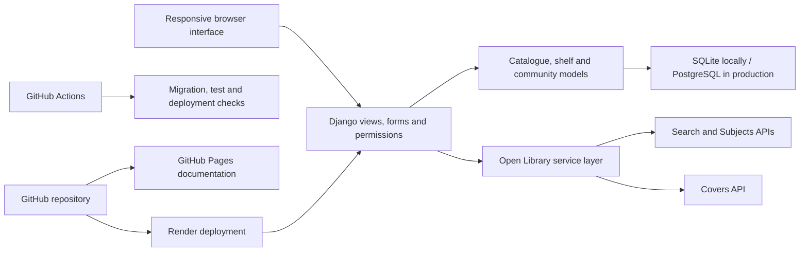
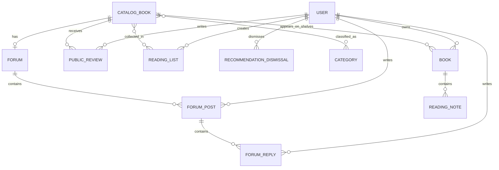

# Reading Compass

Reading Compass is a full-stack reading community for finding books, building a
personal shelf and discovering what to read next. It combines live Open Library
data with a shared local catalogue, private reading tools and public community
features in one responsive Django application.

[**Open the live application**](https://reading-compass.onrender.com/)

[**View the test suite**](TESTING.md)

[**Browse the project documentation**](docs/index.md)

## Product overview

Most reading tools separate book search, personal tracking and community
recommendations. Reading Compass connects them. A reader can search the wider
Open Library catalogue, add a result to a private shelf, record progress and
notes, publish a review, organise public or private lists, join a book forum and
receive suggestions shaped by their own reading.

The shared-catalogue model is central to the product. Book metadata, categories,
ratings and discussions belong to one community record, while status and notes
belong to each individual reader. This avoids duplicate public pages without
weakening personal privacy.

### What readers can do

- Register and sign in with Django's validated authentication flow.
- Search Open Library by title, author, ISBN, subject or reading trait.
- Browse a local catalogue by title, author, ISBN and category.
- Import complete metadata including cover, publisher, publication year and
  categories.
- Track books as Want to Read, Currently Reading, Paused or Completed.
- Search and filter a private shelf by text, status and category.
- Keep private reading notes attached to personal shelf entries.
- Rate and review catalogue books for the wider community.
- Build named reading lists and decide whether each list is public or private.
- Browse public lists and reader profiles without exposing private shelf data.
- Join book-specific forums with posts and threaded replies.
- Dismiss recommendations so unwanted suggestions do not return.

### Personalised discovery

The dashboard turns existing activity into practical suggestions instead of
showing a generic popularity list.

- Categories from the reader's shelf establish their interests.
- Categories attached to reviews rated four stars or higher receive additional
  weight.
- Local candidates are ranked by category overlap and community average rating.
- If the local catalogue cannot fill the result set, the strongest category is
  used to retrieve relevant Open Library books.
- Existing shelf books are excluded by catalogue record, Open Library key and
  ISBN.
- Dismissals are stored per reader for both local and external recommendations.

### Community and moderation

Public book pages bring together metadata, average ratings, reader reviews,
reading lists and discussion. Public profiles deliberately expose only public
lists and published reviews. Staff receive a separate moderation dashboard with
forum, post, reply, review and category activity, plus catalogue refresh and
category-management controls.

Ownership rules remain consistent throughout the application: readers manage
their own shelves, notes, lists, reviews, posts and replies; staff can moderate
community content; anonymous visitors can explore public content but cannot
perform writes.

## Engineering highlights

### Resilient Open Library integration

Open Library access is isolated in a dedicated service layer rather than mixed
into views. Requests use an identifiable User-Agent, a verified CA bundle and
finite timeouts. Responses are schema-checked, normalised into typed search
results, cleaned, deduplicated and ranked before reaching a template. Dashboard
fallback results are cached briefly so repeated page loads do not amplify
provider traffic.

Search relevance handles exact ISBNs, exact and prefix title matches, author and
category matches, token overlap, fuzzy title similarity and edition popularity.
The Subjects API supports trait browsing with pagination. Network, HTTP,
timeout, invalid-JSON and unexpected-schema failures become one controlled
application error; trait pages then fall back to matching books already stored
locally.

### Safe catalogue imports

Search results are not trusted when posted back by the browser. The server signs
and compresses each import payload with a dedicated salt, checks its one-hour
expiry and accepts only an explicit metadata allow-list. The selected reading
status is validated before any database work begins.

The import itself runs atomically. Existing books are resolved by Open Library
key and then ISBN, category input is normalised, and `get_or_create` prevents a
reader from adding the same catalogue record twice. Invalid status values,
expired tokens and tampered tokens are rejected without partial writes.

### Data integrity and privacy

Important rules are enforced below the form layer as database constraints:

- one shared catalogue book per Open Library work key;
- one copy of a catalogue book per reader's shelf;
- one public review per reader and catalogue book;
- one reading-list name per reader;
- one stored dismissal per reader and recommendation;
- non-empty reading-note content and ratings constrained to one through five.

Private queries are owner-scoped at the queryset level. List visibility is
filtered for authenticated and anonymous visitors, while author-or-staff and
staff-only mixins protect community management. Django CSRF protection,
password validation, session authentication, template escaping and clickjacking
middleware protect the standard web flow. Redirect targets are also checked
against the current host before use.

### Efficient server-rendered interface

The application uses Django templates and a single responsive CSS layer, so the
complete experience works without a separate JavaScript application or frontend
build pipeline. Common views use `select_related`, `prefetch_related`, database
aggregation and pagination to avoid repeated relationship queries. The interface
includes responsive grids, clear empty states, labelled forms, keyboard-usable
controls, semantic navigation and an `aria-live` region for operation feedback.

## Technical architecture



### Technology choices

| Area | Technology | Responsibility |
| --- | --- | --- |
| Application | Python 3.12, Django 5.2 | Routing, forms, authentication, validation, ORM, templates and tests |
| Interface | Django templates, custom responsive CSS | Accessible server-rendered pages with no frontend build step |
| Data | SQLite, PostgreSQL, Django migrations | Local development and persistent production storage |
| Book data | Open Library Search, Subjects and Covers APIs | Search, metadata, categories, discovery and cover images |
| Production | Gunicorn, WhiteNoise, Render | WSGI serving, compressed versioned static files and managed hosting |
| Quality | Django TestCase, unittest.mock, GitHub Actions | Isolated automated tests and continuous verification |
| Documentation | Markdown, Mermaid, GitHub Pages | Maintainable project and design documentation |

### Production delivery

The deployment definition is versioned in `render.yaml`. Render provisions the
web service and PostgreSQL database in Singapore, injects secrets through the
environment, builds static assets, applies migrations and starts Gunicorn. A
lightweight `/health/` endpoint supports platform health checks.

Production settings recognise the HTTPS proxy, restrict allowed hosts, use
secure session and CSRF cookies, enable HTTPS redirection and HSTS, require SSL
for PostgreSQL and serve compressed manifest-versioned static assets through
WhiteNoise. Demo content is never seeded implicitly; it requires both demo
password variables to be set.

## Automated quality checks

The repository contains **100 automated tests** across model, form, service,
view, permission, acceptance and end-to-end system behaviour. External API
boundaries are mocked deterministically while parsing, ranking, validation and
database behaviour remain real.

The most important regressions include tampered imports, invalid reading
statuses, duplicate catalogue and shelf records, cross-reader privacy, public
versus private lists, author and staff permissions, recommendation fallbacks,
forum moderation and repeatable demo-data creation.

All test source files and focused commands are linked from the root-level
[**testing guide**](TESTING.md), so the suite is visible without searching
through weekly folders. GitHub Actions runs migration drift detection, the full
suite and Django's production deployment check on every push and pull request.

Test code: [`books/tests.py`](books/tests.py) ·
[`community`](books/test_community.py) ·
[`discovery`](books/test_discovery.py) ·
[`notes`](books/test_notes.py) ·
[`reviews`](books/test_reviews.py) ·
[`system`](books/test_system.py)

## Data model at a glance



The complete ERD and relationship rationale are in
[Database design](docs/design/database-design.md); the current component and
deployment view is in [Architecture](docs/design/architecture.md).

## Run locally

```bash
python3 -m venv .venv
source .venv/bin/activate
python -m pip install -r requirements.txt
python manage.py migrate
python manage.py runserver
```

Open <http://127.0.0.1:8000/> and create an account. To populate a local copy
with repeatable community activity, supply local-only passwords explicitly:

```bash
python manage.py seed_demo_content \
  --reader-password "choose-a-local-reader-password" \
  --admin-password "choose-a-local-admin-password"
```

The command is idempotent and creates readers, an administrator, catalogue
books, categories, shelves, notes, reviews, public and private lists, a forum,
posts and replies.

## Verify a change

```bash
python manage.py check
python manage.py makemigrations --check --dry-run
python manage.py test
python manage.py check --deploy
```

For test ownership and focused commands, open [`TESTING.md`](TESTING.md).

## Repository map

| Path | Contents |
| --- | --- |
| [`books/`](books/) | Domain models, forms, views, Open Library services, migrations, tests and demo command |
| [`reading_compass/`](reading_compass/) | Project URLs, environment-aware settings and deployment entry points |
| [`templates/`](templates/) | Shared layout and book, list, profile, forum, moderation and account pages |
| [`static/`](static/) | Responsive visual system and component styling |
| [`docs/`](docs/) | Current design documentation plus retained iteration records |
| [`.github/workflows/tests.yml`](.github/workflows/tests.yml) | Continuous test and production-readiness checks |
| [`render.yaml`](render.yaml) | Production web service, database and health-check definition |

Current-system documentation is organised by topic so architecture, database,
interface, testing and tools are easy to find. Week-based directories remain as
the chronological development record, but they are not required for navigating
the application or its source.

## Team

- **Tianyang Zhang:** lead developer and technical lead
- **Yuhao Guo:** project coordination, requirements, documentation and QA
