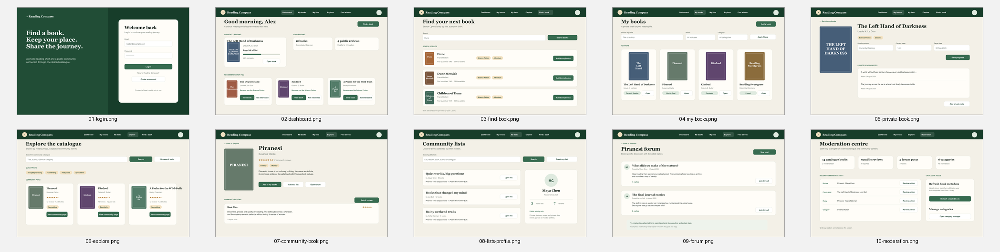

# Reading Compass Design Evidence

This page is the GitHub entry point for the project's major design components.
It addresses the assessment requirement to explain and justify the
architectural, database and user-interface designs rather than presenting
diagrams without context.

## Major design components

| Component | Design evidence | Principal justification |
| --- | --- | --- |
| Architecture | [Architecture design](architecture.md) | A layered Django architecture separates presentation, application services, domain data and external catalogue integration so permissions and business rules remain testable. |
| Database | [Database design](database-design.md) | The relational model separates shared book metadata from owner-scoped reading state and notes, enforcing the project's central public/private boundary. |
| User interface | [Interface design](interface-design.md) and [interactive prototype](interface-prototype.md) | Ten Penpot boards cover the complete reader and staff scope, with traceability, interaction flow, privacy decisions and offline source evidence. |

## Interface prototype submission

[Open the interactive Penpot prototype](https://design.penpot.app/#/workspace?team-id=81f57451-85cc-819d-8008-6f857ab31971&file-id=3be9e5e1-190f-8090-8008-6f8638edd4d2&page-id=3be9e5e1-190f-8090-8008-6f8638edd4d3).

The repository also contains individual PNG previews, editable SVG source
boards, a machine-readable interaction manifest and a downloadable Penpot
import bundle. These files protect the assessment evidence from external-link
or sign-in failures.

## Cross-design consistency

- The architecture's permission boundary appears in the interface as separate
  reader and staff journeys.
- The database distinction between shared catalogue data and private reading
  state is visible in the community and private-book screens.
- User stories map to prototype boards and to the implementation/test evidence
  through the [traceability matrix](../traceability.md).
- Repeated navigation, controls, status labels and cards form a consistent
  component system that can be implemented without inventing new interaction
  patterns during development.
