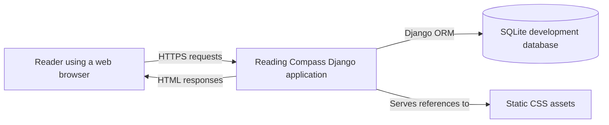
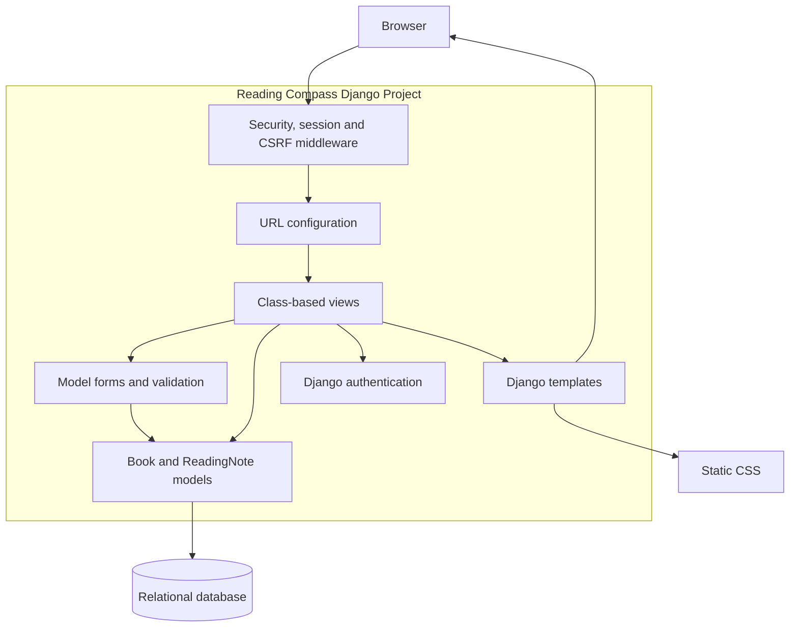
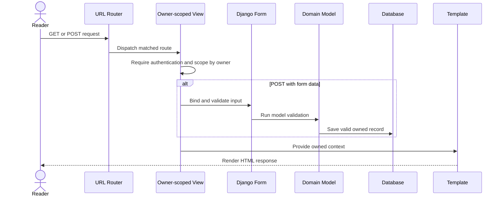

# Reading Compass Architecture Design

## Purpose

Reading Compass uses a server-rendered Django architecture. The design keeps
presentation, request handling, validation and persistence responsibilities
separate while relying on Django's authentication and security middleware.

## System Context

The deployed system should place an HTTPS reverse proxy or managed hosting
platform in front of Django. SQLite is appropriate for local development and
assessment demonstrations; a managed relational database should replace it if
the service grows or requires concurrent production writes.

## Container and Layer View

## Component Responsibilities

| Component | Responsibility | Main implementation |
|---|---|---|
| URL configuration | Maps stable routes to views | `reading_compass/urls.py`, `books/urls.py` |
| Views | Coordinates authenticated request workflows and owner scoping | `books/views.py` |
| Forms | Normalises input and reports user-facing validation errors | `books/forms.py` |
| Models | Stores reading data and enforces domain validation | `books/models.py` |
| Templates | Renders accessible server-side HTML | `templates/` |
| Authentication | Registration, login, logout and session handling | Django auth plus `RegisterView` |
| Tests | Verifies model, form, view, privacy and integrated workflows | `books/tests.py`, `books/test_*.py` |

## Main Request Flow

## Security Boundaries

- Every book list, detail, edit and delete query is restricted to the signed-in
  owner.
- Reading-note and completion-review mutations also use owner-scoped queries.
- Django CSRF middleware and tokens protect state-changing forms.
- Django password hashing and authentication manage credentials and sessions.
- Templates escape user content by default.
- Production deployment must supply a secret key, disable debug mode, use
  HTTPS and enable secure session and CSRF cookies.

## Architectural Rationale

The project uses Django's conventional Model-Template-View structure because
it is small, form-centred and does not need a separate JavaScript API client.
Server-rendered pages reduce deployment and state-management complexity. The
owner-scoped query pattern keeps privacy enforcement close to every object
lookup, and reusable forms centralise validation across create and update
workflows.

## Quality Attributes

| Attribute | Design response |
|---|---|
| Privacy | Owner-scoped querysets and authenticated routes |
| Maintainability | Separate models, forms, views, URLs and templates |
| Testability | Deterministic Django tests with an isolated test database |
| Usability | Consistent cards, forms, status labels and navigation |
| Data integrity | Model/form validation and relational foreign keys |
| Evolvability | Django migrations and modular `books` application |

