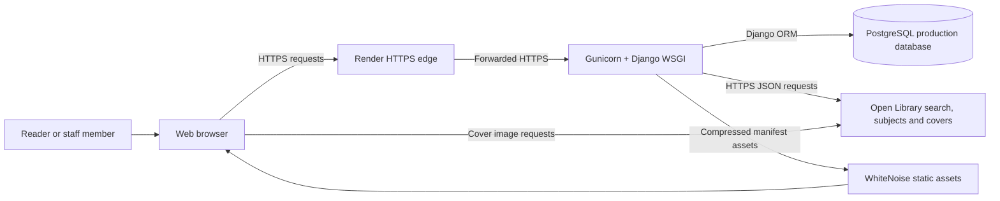
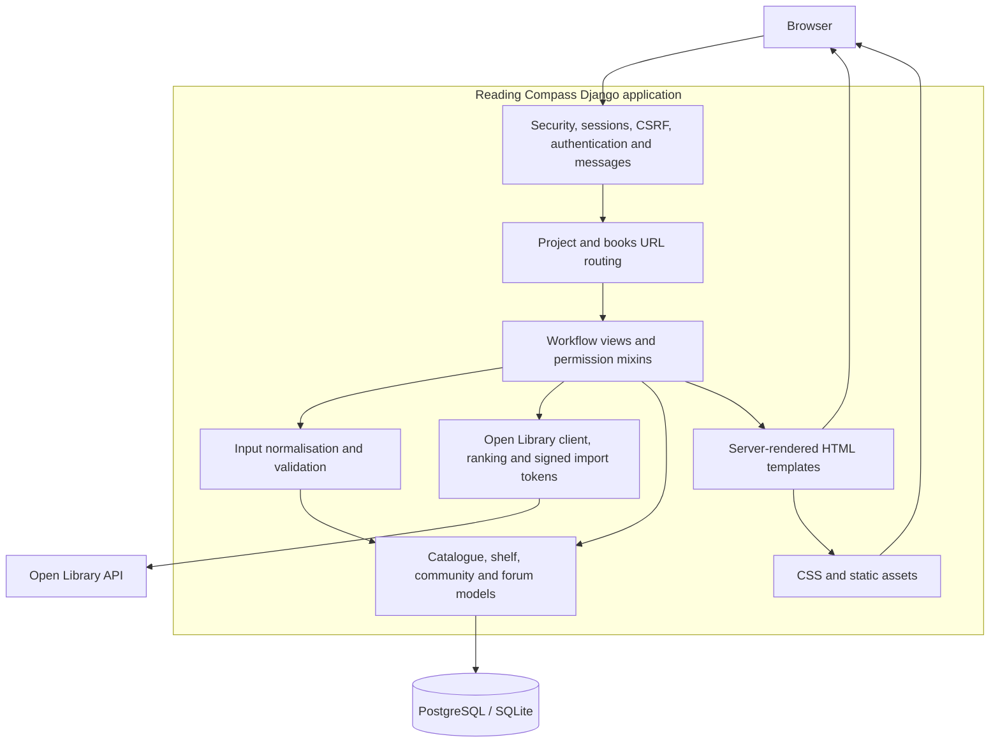
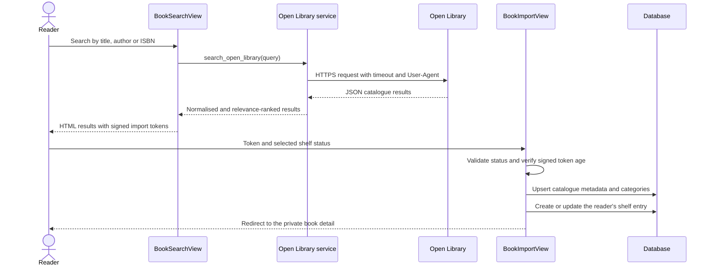
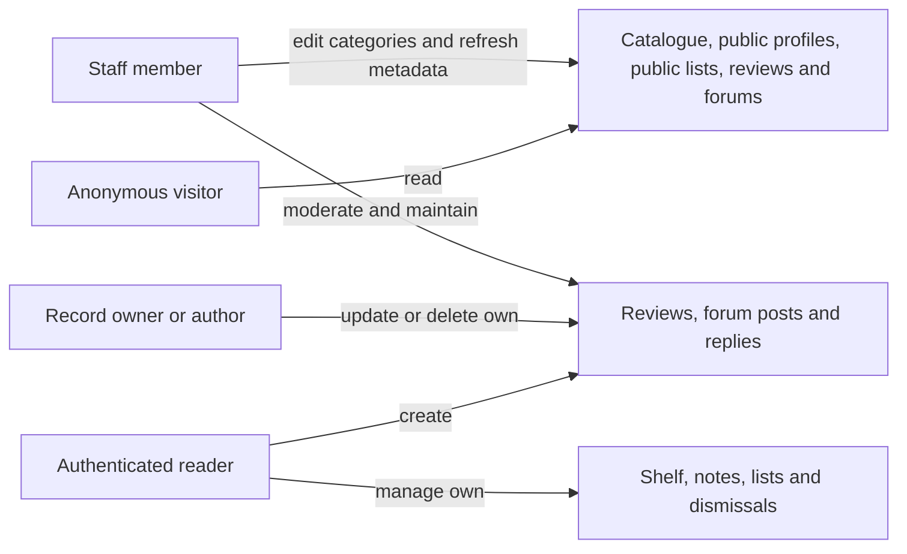
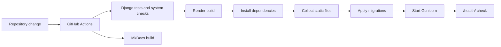

# Reading Compass Architecture Design

## Purpose

Reading Compass is a server-rendered Django application that combines a private
reading shelf with a shared catalogue, discovery, recommendations, public
reviews, reading lists and book forums. Request handling, validation,
persistence and presentation remain separated through Django's conventional
Model-Template-View structure.

## System Context and Deployment

Local development uses SQLite and Django's development server. Production uses
the `DATABASE_URL` supplied by Render, persistent PostgreSQL connections with
health checks, Gunicorn, HTTPS-aware settings and WhiteNoise compressed static
files. The `/health/` route provides a lightweight platform health check.

## Application Containers and Components

## Component Responsibilities

| Component | Responsibility | Main implementation |
|---|---|---|
| URL configuration | Maps stable public, authenticated and staff routes | `reading_compass/urls.py`, `books/urls.py` |
| Views and permission mixins | Coordinates shelf, discovery, community, forum and moderation workflows; applies owner/author/staff scope | `books/views.py` |
| Forms | Normalises input and presents field-level validation | `books/forms.py` |
| Services | Calls Open Library, normalises/ranks results, handles failures and signs import payloads | `books/services.py` |
| Models | Stores shared catalogue, private shelf and community data; enforces relational rules | `books/models.py` |
| Templates | Renders accessible server-side pages and CSRF-protected forms | `templates/` |
| Static delivery | Provides the responsive visual system in development and production | `static/`, WhiteNoise |
| Authentication | Registration, login, logout, sessions and password validation | Django authentication plus `RegisterView` and `SafeLoginView` |
| Tests | Exercises models, services, views, permissions and complete workflows | `books/tests.py`, `books/test_*.py` |

## Catalogue Search and Import Flow

The import token contains only allow-listed metadata and is signed with a
dedicated salt. It expires after one hour. Reading status is checked against the
model choices before any catalogue or shelf record is written.

## Community and Permission Boundaries

- Private shelf and note queries are restricted to the signed-in owner.
- Reading-list edit operations require ownership; non-public lists are visible
  only to their owner.
- Review, post and reply changes require authorship or staff permission.
- Forum deletion, catalogue refresh, category maintenance and the moderation
  dashboard require staff access.
- Django CSRF protection guards state-changing forms; password hashing,
  session middleware, template escaping and clickjacking protection use Django
  defaults.
- Production settings derive secrets and hosts from the environment, trust the
  Render HTTPS proxy and can enable secure cookies and HSTS.

## Failure Handling

Open Library calls have finite timeouts and translate HTTP, network, timeout and
invalid-JSON failures into `BookSearchError`. Views show a controlled message or
fall back to locally stored catalogue data. Database constraints provide the
final defence against duplicate shelf entries, reviews, list names and
recommendation dismissals.

## Delivery Pipeline

Demo data is not part of the normal build. It is seeded only when both explicit
demo password environment variables are present.

## Quality Attributes

| Attribute | Design response |
|---|---|
| Privacy | Owner-scoped private queries and visibility checks for lists |
| Integrity | Model validation, signed imports and database constraints |
| Availability | Managed deployment, health check and controlled external-service failures |
| Maintainability | Conventional Django layers and a dedicated external-service module |
| Testability | Isolated test database and deterministic mocked network boundaries |
| Accessibility | Semantic server-rendered HTML, labelled forms and responsive CSS |
| Evolvability | Versioned migrations and separate catalogue, shelf and community entities |
