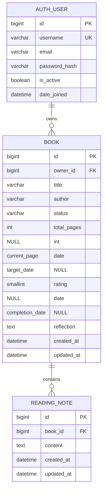

# Reading Compass Database Design

## Entity-Relationship Diagram

## Relationship Rules

- One authenticated user owns zero or more books.
- Every book belongs to exactly one user.
- One book contains zero or more private reading notes.
- Every reading note belongs to exactly one book.
- Deleting a user cascades to their books; deleting a book cascades to its
  notes. This prevents orphaned private records.

## Domain Rules

| Rule | Enforcement |
|---|---|
| `total_pages` is absent or at least 1 | Django field validator |
| `current_page` is non-negative | Positive integer field |
| `current_page` does not exceed `total_pages` | `Book.clean()` |
| Status is one of four controlled values | Django `TextChoices` |
| Rating is absent or between 1 and 5 | Minimum and maximum validators |
| A review belongs only to a completed book | `Book.clean()` and owner-scoped review view |
| Completion date is not in the future | Form and model validation |
| Reflection is at most 1000 characters | Field and explicit validator |
| Reading-note content is not blank | Form/model validation and database check constraint |

## Normalisation and Design Decisions

The design is in third normal form for the current scope. User identity remains
in Django's authentication table, books reference the owner by key, and
repeatable notes are stored separately rather than as columns on `Book`.
Completion review data stays on `Book` because the requirements allow at most
one completion review per book and it shares the book lifecycle.

## Privacy and Indexing

Application queries always include the owner relationship before exposing a
book or note. Foreign-key indexes created by Django support owner and book
lookups. If the dataset grows, a composite index on `(owner_id, status)` and
search-oriented indexes for title and author should be evaluated using query
measurements rather than added prematurely.

## Migration Traceability

The schema is versioned through `books/migrations/0001_initial.py` to
`0005_book_completion_date_book_rating_book_reflection.py`. Automated checks
confirm that committed models do not have ungenerated migration changes.

