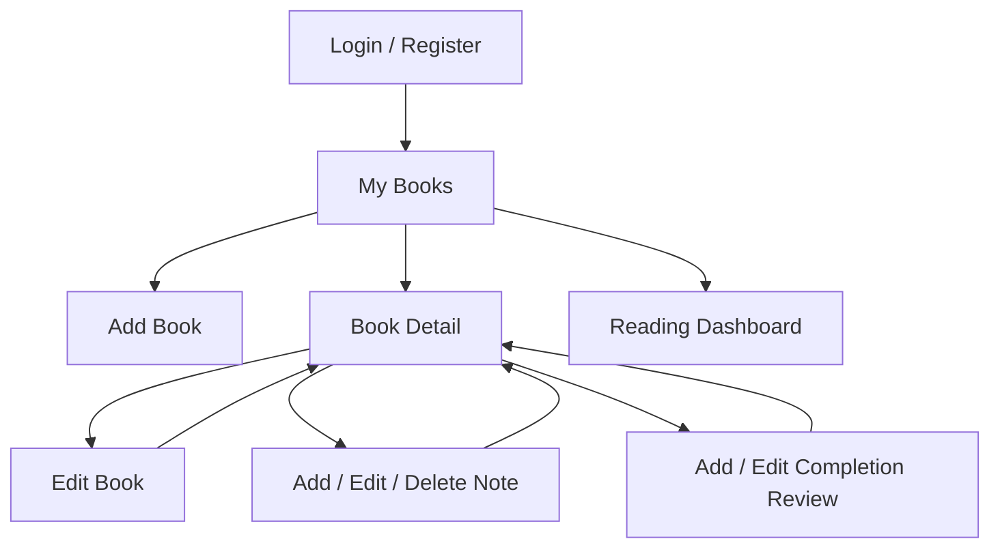

# Reading Compass Interface Design and Prototype

## Interactive Design File

The interface prototype was created in Figma:

**[Open the Reading Compass UI Prototype](https://www.figma.com/design/W71vyrP3fQDQNbPXS7RjTx)**

The file contains three desktop screens representing the principal workflow:

1. **My Books** — navigation, search, status filtering and book cards.
2. **Book Detail** — progress metadata, completion review and private notes.
3. **Add Book** — the primary data-entry form and validation-oriented fields.

## Design Goals

- Keep the main reading workflow understandable without training.
- Make private, owner-specific information visually clear.
- Maintain consistent navigation and action placement.
- Use readable form labels and visible status information.
- Support responsive layouts without relying on images or complex scripts.

## Information Architecture

## Visual System

| Token | Value | Purpose |
|---|---|---|
| Ink | `#20251f` | Primary text |
| Muted | `#667064` | Secondary text and labels |
| Paper | `#f6f4ed` | Page background |
| Surface | `#fffdf8` | Cards, forms and navigation |
| Line | `#d9ddd3` | Borders and separators |
| Green | `#315c46` | Primary actions and emphasis |
| Danger | `#a2382d` | Destructive actions |

Body text uses the system UI font stack for platform-native legibility. Major
page headings use Georgia to distinguish the product voice. Cards use an
18-pixel radius, restrained borders and a soft shadow.

## Screen-Level Decisions

### My Books

- Search and status filter controls appear before results.
- Book cards expose status, title, author and progress without opening details.
- Empty and no-results states give a single clear recovery action.

### Book Detail

- Book metadata is grouped before destructive or editing actions.
- Completion review appears only when the book is completed.
- Notes are explicitly labelled private and remain attached to their book.

### Add Book

- Labels remain visible above every input.
- Status guidance explains the four allowed reading states.
- Optional planning data is distinguished from required identity fields.
- Save and cancel actions appear together at the end of the form.

## Accessibility and Responsive Behaviour

- Templates use landmarks, headings, labels and definition lists.
- Keyboard focus receives a visible green outline.
- Text and controls maintain sufficient contrast against paper and surface
  colours.
- Below 720 pixels, filter controls stack vertically.
- Book grids use responsive minimum card widths rather than fixed columns.
- Destructive actions require a separate confirmation screen.

## Prototype-to-Code Traceability

| Prototype area | Implementation |
|---|---|
| Global navigation | `templates/base.html` |
| My Books and filters | `templates/books/book_list.html` |
| Book cards and detail | `templates/books/book_list.html`, `book_detail.html` |
| Add/Edit form | `templates/books/book_form.html` |
| Review form | `templates/books/review_form.html` |
| Notes workflow | `templates/books/note_*.html` |
| Visual tokens and responsive rules | `static/css/app.css` |

