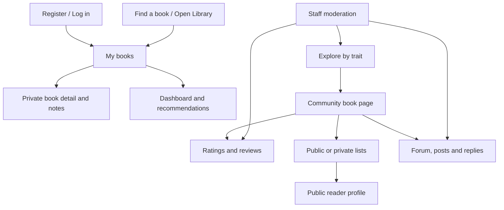

# Reading Compass Interface Design

## Information architecture

## Screen decisions

- **My books:** owner-scoped cards, title/author search, status/category filters and direct status updates.
- **Dashboard:** currently-reading focus plus ranked, dismissible recommendations.
- **Find a book:** one search field for title, author or ISBN with a manual fallback.
- **Explore:** trait search, quick categories, local catalogue cards and public rating summaries.
- **Community book:** metadata, categories, shelf/list actions, reviews and forum entry.
- **Lists and profiles:** visible privacy state, owner actions and public-only discovery.
- **Forums:** posts and threaded replies keep discussion attached to a catalogue book.
- **Moderation:** staff-only summary and actions for shared public content.

## Accessibility and responsive behaviour

Forms use associated labels and visible error messages; navigation and actions use semantic links/buttons; status is communicated with text as well as colour; keyboard focus remains visible; cards collapse to a single column at narrow widths; destructive actions require confirmation.

## Visual system

- Deep forest navigation and warm paper surfaces give the product a consistent editorial identity.
- Georgia headings distinguish discovery and reading content; the system font stack keeps controls and body copy clear.
- Reusable green primary actions, outlined secondary actions, gold category tags and text-labelled status chips keep meaning consistent across screens.
- Raised cards, restrained gradients and book-cover shadows add hierarchy without changing the server-rendered interaction model.
- Motion is limited to short hover transitions and is disabled when reduced motion is requested.

## Prototype-to-code evidence

The deployed implementation at https://reading-compass.onrender.com/ is the
acceptance reference. Templates under `templates/` implement the screen
hierarchy and `static/css/app.css` provides the responsive visual system. The
complete reader and staff journeys are represented by ten editable boards in
the [Reading Compass Penpot prototype](https://design.penpot.app/#/workspace?team-id=81f57451-85cc-819d-8008-6f857ab31971&file-id=3be9e5e1-190f-8090-8008-6f8638edd4d2&page-id=3be9e5e1-190f-8090-8008-6f8638edd4d3).
The [prototype evidence page](interface-prototype.md) supplies an offline
overview, source boards, interaction manifest and requirements traceability.
