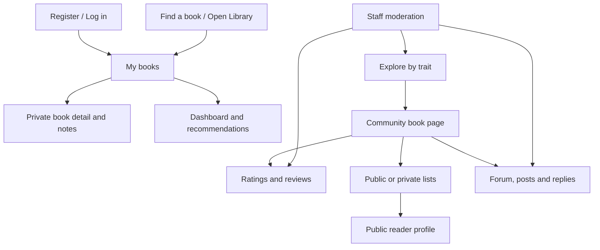

# Reading Compass Interface Design

## Information architecture

## Screen decisions

- **My books:** owner-scoped cards, title/author search, status/category filters and direct status updates.
- **Dashboard:** currently-reading focus plus ranked, dismissible recommendations.
- **Find a book:** one search field for title, author or ISBN with a manual fallback.
- **Explore:** trait search, quick categories, local catalogue cards and public rating summaries.
- **Community book:** metadata, categories, shelf/list actions, reviews and forum entry.
- **Lists and profiles:** visible privacy state, owner actions and public-only discovery.
- **Forums:** posts and threaded replies keep discussion attached to a catalogue book.
- **Moderation:** staff-only summary and actions for shared public content.

## Accessibility and responsive behaviour

Forms use associated labels and visible error messages; navigation and actions use semantic links/buttons; status is communicated with text as well as colour; keyboard focus remains visible; cards collapse to a single column at narrow widths; destructive actions require confirmation.

## Prototype-to-code evidence

The deployed implementation at https://reading-compass.onrender.com/ is the acceptance reference. Templates under `templates/` implement the screen hierarchy and `static/css/app.css` provides the responsive visual system.
