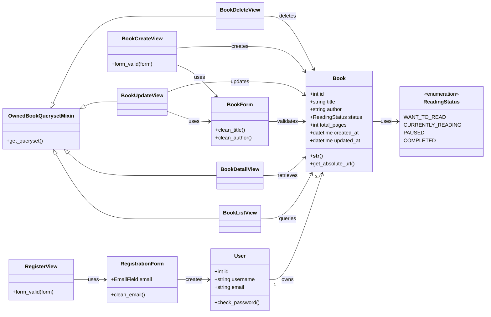
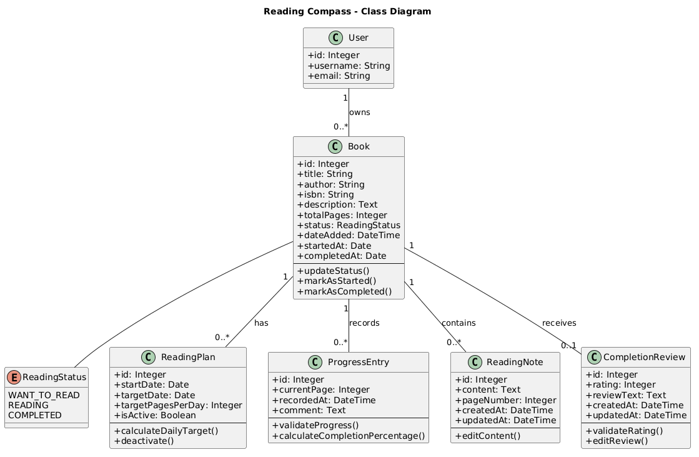

# Reading Compass Class Diagram

## 1. Purpose

This diagram describes the principal classes currently used by the Iteration 1 implementation. Django framework classes are included only where they clarify inheritance or collaboration.

## 2. Exported Diagram

The exported UML image is stored at [`diagrams/class-diagram.png`](diagrams/class-diagram.png).

## 3. Design Notes

- `User` is provided by Django's authentication system.
- Each `Book` has exactly one owner, while a user may own many books.
- `ReadingStatus` restricts status values to four valid choices.
- `BookForm` exposes only editable book fields; ownership is assigned by the server.
- `OwnedBookQuerysetMixin` filters queries by the authenticated user and prevents cross-user access.
- The class-based views separate list, detail, creation, update and deletion responsibilities.

## 4. Responsibility Review

The design keeps the current Iteration 1 responsibilities separated:

- Models define stored data and domain choices.
- Forms validate user input.
- Views coordinate HTTP workflows.
- Templates present information.
- Authentication and ownership checks protect private data.