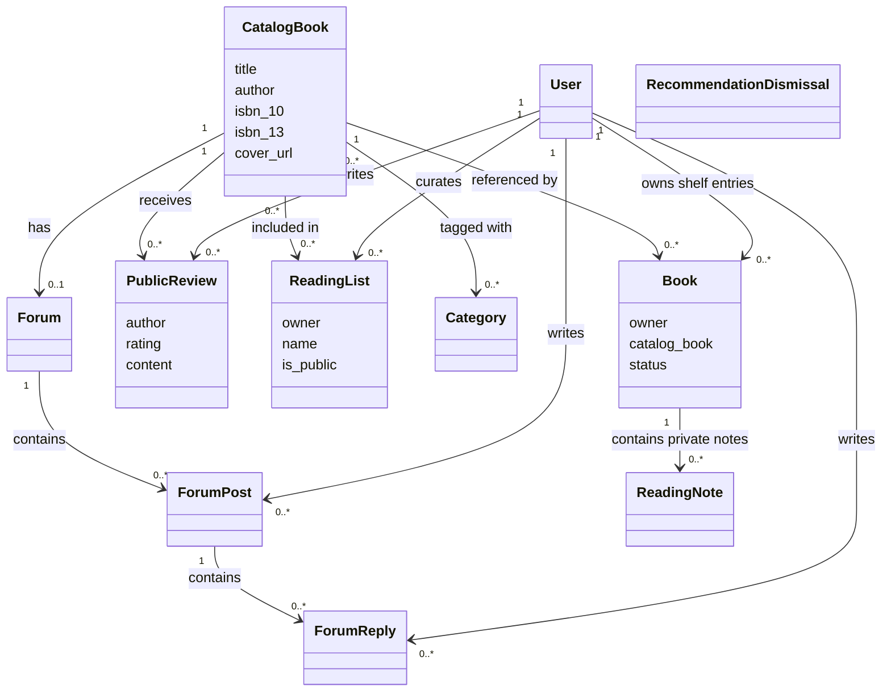

# Reading Compass Domain Class Diagram

## Design interpretation

The shared `CatalogBook` prevents repeated metadata. `Book` is the private owner-to-catalogue relationship and holds reading status; `ReadingNote` remains below that private boundary. Reviews, public lists and forums attach to catalogue books so community content is shared deliberately. Unique constraints prevent duplicate shelf entries, duplicate reader reviews, duplicate dismissals and multiple forums for one book.
