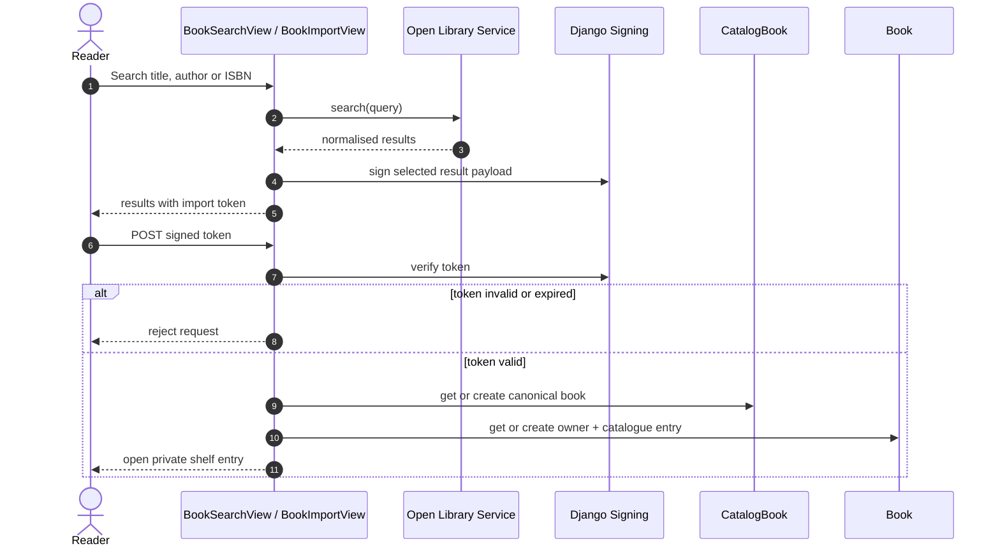

# Catalogue Search and Private-Shelf Import Sequence

The external response is never trusted as an ownership decision. Import metadata is signed before round-tripping through the browser, canonical catalogue data is reused, and the authenticated server-side user becomes the shelf owner.
