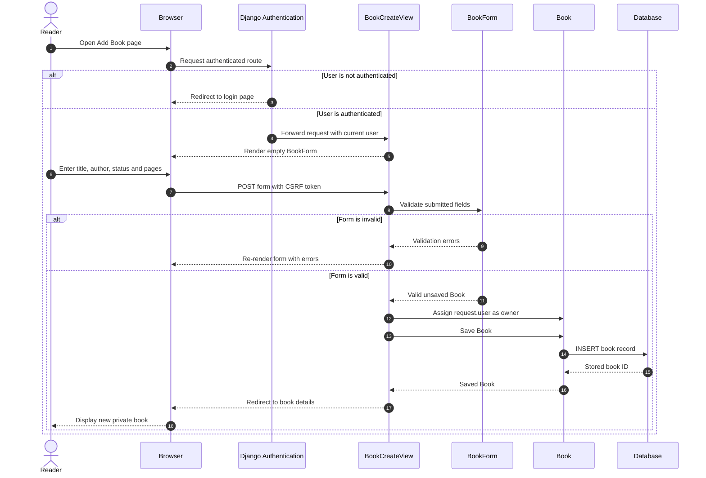

# Reading Compass Sequence Diagram

## Add a Book to the Personal Reading List

The sequence illustrates the authenticated book-creation workflow, including server-side ownership assignment and validation.



## Security Significance

- Authentication is checked before the create view is available.
- The browser cannot select the owner.
- `BookCreateView` assigns the authenticated user on the server.
- CSRF protection is included in the form submission.
- Validation occurs before data is stored.

## Related Ownership Flow

For viewing, editing and deleting an existing book, `OwnedBookQuerysetMixin` limits the queryset to:

```text
Book.objects.filter(owner=request.user)
```

If a user requests another user's book ID, Django returns `404 Not Found` rather than exposing the record.

