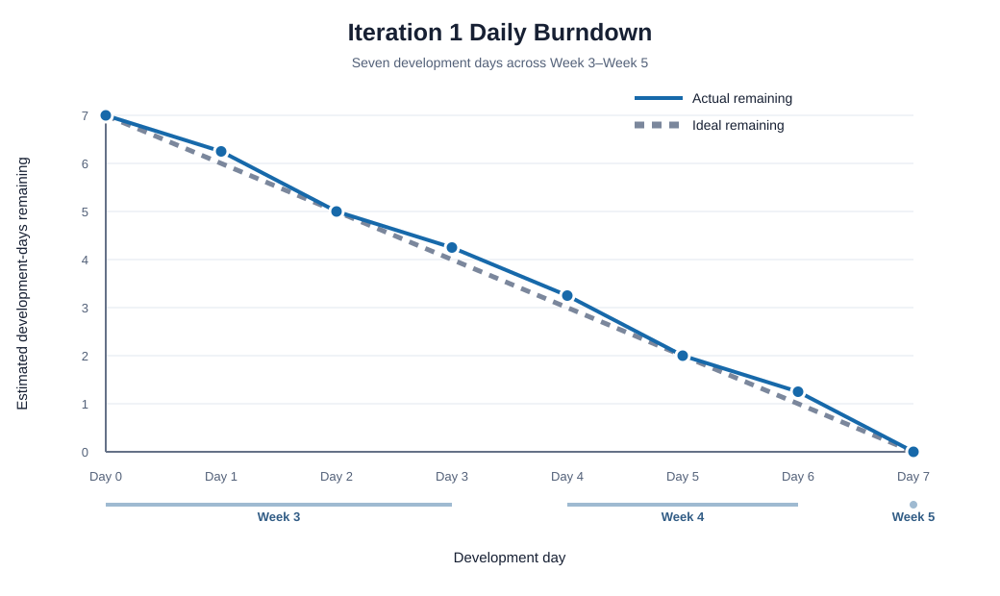

# Practical 6 Report

## Iteration 2 — Reflection and Adjusted Plan

**Planning checkpoint:** Week 6

## 1. Iteration 1 Review

Iteration 1 delivered all three planned stories:

| No. | User Story | Estimate | Status |
| --- | --- | ---: |:---:|
| 01 | User Account Access | 2 days | done |
| 02 | Personal Reading List | 3 days | done |
| 03 | Reading Status Management | 2 days | done |
| **Total** |  | **7 days** | **7 days done** |

There was no unfinished Iteration 1 story and no carry-over. The actual
velocity is:

```text
2 + 3 + 2 = 7 estimated development-days
```

This gives a 100% completion rate and establishes **7 estimated
development-days** as the Iteration 2 capacity.

The completed story descriptions and acceptance evidence remain published in
the [Iteration 1 user-story pages](../week5/user-stories/README.md). The
[SRP and DRY review](../week5/srp-dry-review.md) found focused model, form and
view responsibilities and centralised owner filtering and status choices. It
also records the completed removal of repeated form-field markup.

## 2. Iteration 1 Burndown



The graph uses the daily task record maintained across the seven development
days:

| Course Point | Daily Effort | Ideal Remaining | Actual Remaining |
|---|---:|---:|---:|
| Week 3 Start | 0.00 day | 7.00 | 7.00 |
| Week 3 Day 1 | 0.75 day | 6.00 | 6.25 |
| Week 3 Day 2 | 1.25 days | 5.00 | 5.00 |
| Week 3 Day 3 | 0.75 day | 4.00 | 4.25 |
| Week 4 Day 1 | 1.00 day | 3.00 | 3.25 |
| Week 4 Day 2 | 1.25 days | 2.00 | 2.00 |
| Week 4 Day 3 | 0.75 day | 1.00 | 1.25 |
| Week 5 Day 1 | 1.25 days | 0.00 | 0.00 |

The curve records small variances caused by environment setup, form validation
and usability feedback. Reuse of the existing view and owner-query patterns
allowed the team to recover the variance without removing acceptance criteria.
The detailed work, status transitions and repository evidence for each day are recorded in the
[Iteration 1 Burndown](../week3/burndown.md). Story 01 reached `done` on Week 3
Day 2, Story 02 on Week 4 Day 2 and Story 03 on Week 5 Day 1. The daily record
totals 7 estimated development-days and is consistent with the final velocity.

### Iteration 1 Retrospective Action

One Iteration 1 implementation commit covered work from several development
days, which made the daily history harder to compare with the burndown. For
Iteration 2, each active development day will end with:

1. at least one scoped commit;
2. updated GitHub Issue labels and Project status;
3. updated remaining effort; and
4. a short record of blockers, review feedback and scope decisions.

This keeps the burndown, issue board and repository history on the same timeline.

## 3. Iteration 2 Backlog Adjustment

Iteration 2 starts in **Week 6**. Its original scope was 8 estimated days,
which exceeded the measured velocity by 1 day. The adjusted scope is:

| No. | User Story | Priority | Original | Adjusted | Status |
| --- | --- |:---:|---:|---:|:---:|
| 04 | Reading Progress Updates | 10 | 3 days | 3 days | in-progress |
| 05 | Reading Dashboard | 20 | 3 days | 2 days | todo |
| 06 | Reading Plans | 20 | 2 days | 2 days | todo |
| **Total** |  |  | **8 days** | **7 days** | |

Story 05 is reduced to 2 days by limiting the Iteration 2 dashboard to active
books, page progress and optional target dates. Charts, recommendations and
reading-history analytics are outside this iteration. This preserves all
higher-priority stories while matching the demonstrated capacity.

## 4. Iteration 2 User Stories and Acceptance Criteria

### Story 04 — Reading Progress Updates

As a reader, I want to update my current reading position so that I can see how
much of a book I have completed.

Acceptance criteria:

- current page is non-negative and cannot exceed a known total page count;
- relevant views show the current page and calculated percentage;
- missing total-page data does not produce a misleading percentage; and
- progress remains private to the book owner.

### Story 05 — Reading Dashboard

As a reader, I want to view a personal dashboard so that I can quickly
understand my current reading activity.

Acceptance criteria:

- the dashboard requires authentication;
- it contains only the reader's currently-reading books;
- it shows available progress and target information; and
- empty and incomplete-data states are clear.

### Story 06 — Reading Plans

As a reader, I want to set an optional completion target so that I can plan my
reading without being forced to schedule every book.

Acceptance criteria:

- a reader can add, change and remove a target date on their own book;
- the target is optional and a newly entered past date is rejected;
- the target appears on book details and the dashboard; and
- target information remains private to the book owner.

## 5. Iteration 2 Tasks and Status

Statuses use `todo`, `in-progress` and `done`. Story 04 is `in-progress`
because its scope, validation rules and task plan have been started in Week 6;
implementation tasks remain `todo` until development begins.

| Story | Task | Owner | Estimate | Status |
| --- | --- | --- | ---: |:---:|
| 04 | [Confirm progress acceptance criteria and validation rules](https://github.com/unvde/CP3407-Assessment/issues/16) | Tianyang Zhang / Yuhao Guo | 0.25 day | done |
| 04 | [Add current-page data and migration](https://github.com/unvde/CP3407-Assessment/issues/17) | Tianyang Zhang | 0.50 day | todo |
| 04 | [Implement validation and owner-only progress update](https://github.com/unvde/CP3407-Assessment/issues/18) | Tianyang Zhang | 0.75 day | todo |
| 04 | [Display page progress and percentage](https://github.com/unvde/CP3407-Assessment/issues/19) | Tianyang Zhang | 0.50 day | todo |
| 04 | [Add progress and access-control tests](https://github.com/unvde/CP3407-Assessment/issues/20) | Tianyang Zhang | 0.75 day | todo |
| 04 | [Complete acceptance review](https://github.com/unvde/CP3407-Assessment/issues/21) | Yuhao Guo | 0.25 day | todo |
| 05 | [Build owner-scoped dashboard query and view](https://github.com/unvde/CP3407-Assessment/issues/22) | Tianyang Zhang | 0.75 day | todo |
| 05 | [Build dashboard and empty-state interface](https://github.com/unvde/CP3407-Assessment/issues/23) | Tianyang Zhang | 0.50 day | todo |
| 05 | [Add dashboard authentication and isolation tests](https://github.com/unvde/CP3407-Assessment/issues/24) | Tianyang Zhang | 0.50 day | todo |
| 05 | [Complete acceptance review](https://github.com/unvde/CP3407-Assessment/issues/25) | Yuhao Guo | 0.25 day | todo |
| 06 | [Add optional target date and migration](https://github.com/unvde/CP3407-Assessment/issues/26) | Tianyang Zhang | 0.50 day | todo |
| 06 | [Implement target validation and editing](https://github.com/unvde/CP3407-Assessment/issues/27) | Tianyang Zhang | 0.75 day | todo |
| 06 | [Add target-date and access-control tests](https://github.com/unvde/CP3407-Assessment/issues/28) | Tianyang Zhang | 0.50 day | todo |
| 06 | [Complete acceptance review](https://github.com/unvde/CP3407-Assessment/issues/29) | Yuhao Guo | 0.25 day | todo |

The task totals are 3 days for Story 04, 2 days for Story 05 and 2 days for
Story 06. A story moves to `done` only after its implementation, automated
tests and acceptance review are complete.

### Iteration 2 Development Schedule

| Course Point | Planned work |
|---|---|
| Week 6 Day 1 | Review Iteration 1, adjust the backlog and confirm Story 04 acceptance rules |
| Week 7 Day 1 | Curate the core regression tests and write the Practical 7 test plan |
| Week 7 Day 2 | Add the current-page field and migration |
| Week 7 Day 3 | Complete Story 04 validation, display, tests and acceptance review |
| Week 7 Day 4 | Complete the owner-scoped dashboard and its tests |
| Week 7 Day 5 | Complete optional reading targets and their tests |
| Week 7 Day 6 | Run the final suite, finish documentation and update GitHub tracking |

Practical 8 and Iteration 3 begin at **Week 8 Day 1**.

## 6. GitHub Iteration Tracking

The [Reading Compass — Iteration 2 Project](https://github.com/users/unvde/projects/3)
uses GitHub's iterative-development template. The Week 6 status is:

| Project Status | Items |
| --- | ---: |
| Backlog | 15 |
| In progress | 1 |
| In review | 0 |
| Done | 1 |

The story issues are:

- [#15 — Story 04: Reading Progress Updates](https://github.com/unvde/CP3407-Assessment/issues/15), labelled `in-progress`;
- [#14 — Story 05: Reading Dashboard](https://github.com/unvde/CP3407-Assessment/issues/14), labelled `todo`; and
- [#13 — Story 06: Reading Plans](https://github.com/unvde/CP3407-Assessment/issues/13), labelled `todo`.

Issue #16 is closed with the `done` label and Project Status = Done. Issues
#17–#29 are assigned and labelled `todo`. The Iteration 1 Project retains only
Issues #1–#9, all with Project Status = Done.

## 7. Practical 6 Completion

- Iteration 1 actual velocity is calculated and applied to Iteration 2.
- Iteration 1 SRP and DRY findings are linked and retained.
- The Iteration 1 burndown is recorded as a chart.
- Completed and unfinished Iteration 1 stories are reconciled.
- Iteration 2 is adjusted to the 7-day capacity.
- Iteration 2 stories, acceptance criteria, tasks and statuses are recorded.
- Iteration 2 story and task issues are assigned, labelled and added to the
  Iteration 2 GitHub Project.
- Completed Iteration 1 story pages remain the published completion evidence.

The Week 6 planning checkpoint is complete.
