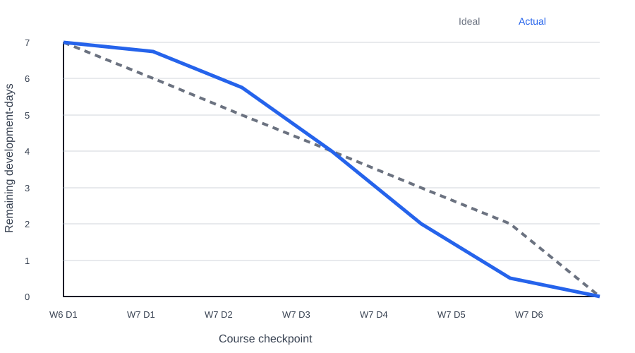

# Iteration 2 Burndown

| Course point | Ideal remaining | Actual remaining | Acceptance checkpoint |
| --- | ---: | ---: | --- |
| Start | 7 | 7 | Stories #4–#6 Todo |
| Day 1 | 6 | 6 | category model and normalisation active |
| Day 2 | 5 | 5 | subject discovery and pagination active |
| Day 3 | 4 | 4 | fallback tests active |
| Day 4 | 3 | 3 | Story #4 accepted |
| Day 5 | 2 | 2 | Story #5 accepted |
| Day 6 | 1 | 1 | list/profile privacy acceptance active |
| Day 7 | 0 | 0 | Story #6 and complete regression accepted |

Accepted effort totals seven development-days and remaining effort reaches zero. The supporting SVG is retained as a visual representation of the same seven-to-zero trend.

